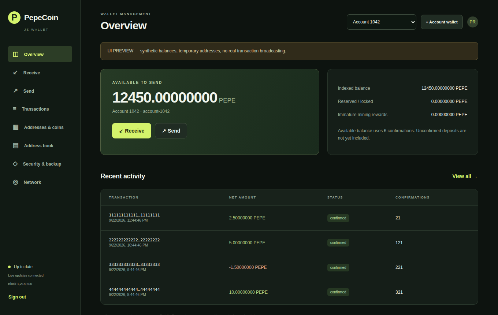
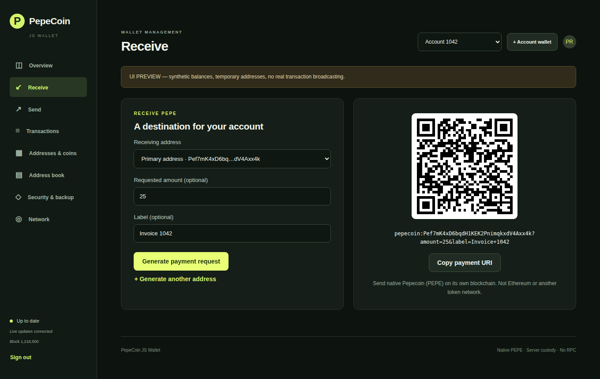
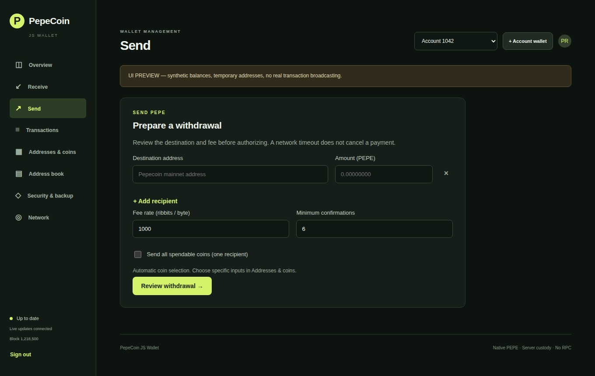
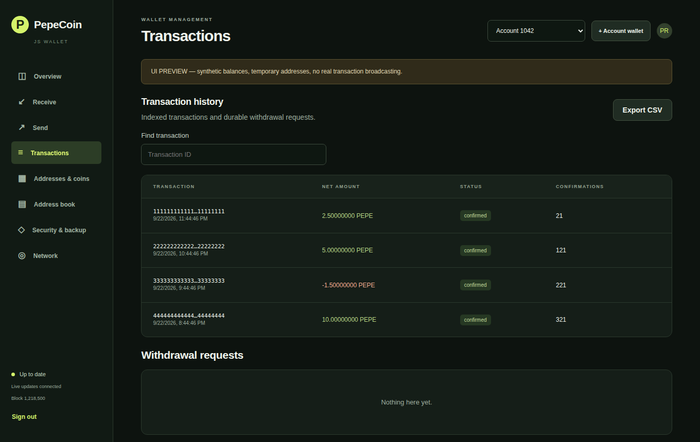
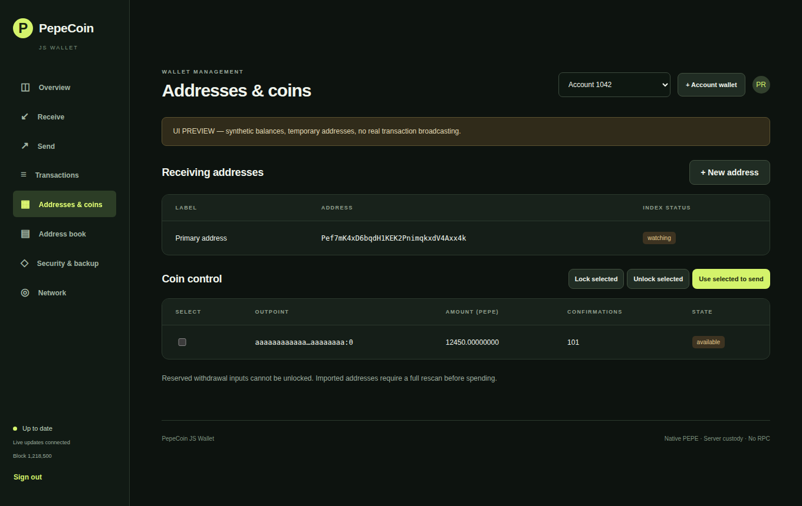
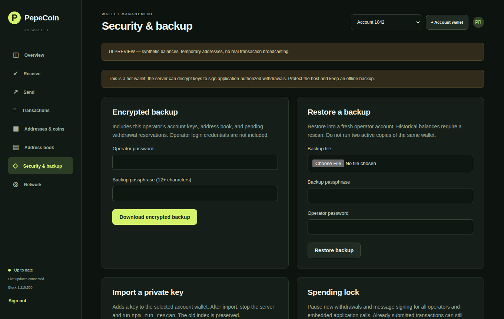
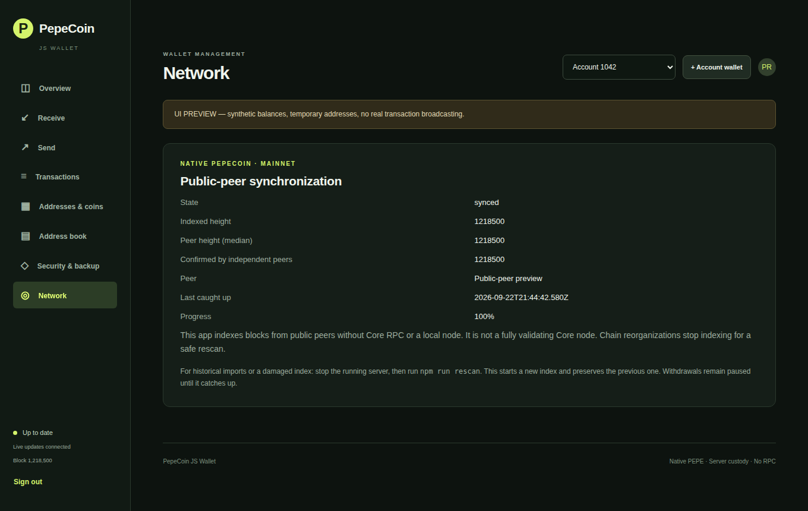
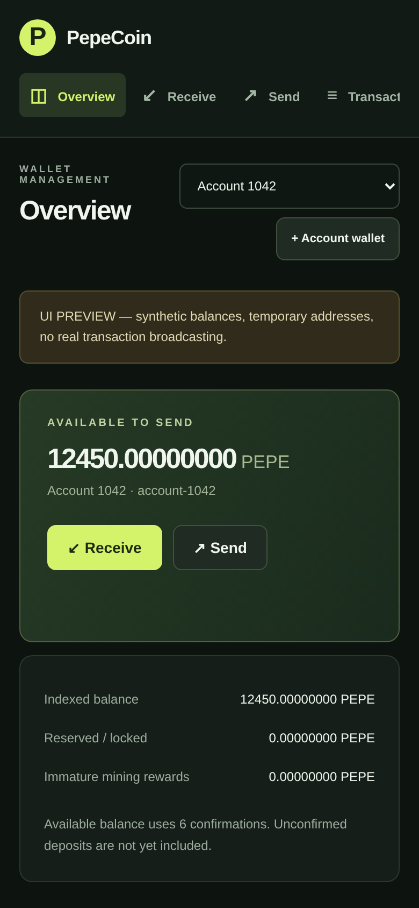

# PepeCoin JS Wallet — app

This is the runnable app repository. It contains the root npm workspace and startup scripts, with two separate repositories pinned as Git submodules:

```text
wallet/   pepecoin-js-wallet — wallet library, public-peer sync, signing and storage
web/      pepecoin-js-wallet-web — optional HTTP server, WebSocket updates and UI
data/     existing wallet data (unchanged; never included in the library package)
```

## Screenshots

Captured from `npm run preview` (synthetic balances and temporary keys; nothing is broadcast).

| Overview | Receive |
| --- | --- |
|  |  |
| **Send** | **Transactions** |
|  |  |
| **Addresses & coins** | **Security & backup** |
|  |  |
| **Network** | **Mobile** |
|  |  |

## Run the web wallet

Requires Node.js **24.13.0 or newer**. Storage uses [Node’s built-in SQLite](https://nodejs.org/api/sqlite.html), so this project requires no Python, node-gyp, or C/C++ build tools. Node 24 may print an experimental SQLite warning; this is not an installation failure.

```sh
git clone --recurse-submodules https://github.com/SourceCodeAndStuff/pepecoin-js-wallet-app.git
cd pepecoin-js-wallet-app
npm ci
npm start
```

All three repositories are private: your GitHub account must have access to the app, wallet library, and web repositories. In SourceTree, clone this app repository with submodules enabled. If already cloned without submodules, run `git submodule update --init --recursive` before `npm ci`.

The `wallet/` and `web/` entries point to specific tested commits, not whichever versions happen to be newest. To update an existing checkout, first commit or preserve your local changes, then run:

```sh
git pull --ff-only
git submodule update --init --recursive
npm ci
```

Stop the running server before deploying updates, and restart it afterward. Changes inside a submodule must be committed and pushed to that repository first; then commit the updated submodule reference in this app repository.

Deploy the updated `package.json`, `package-lock.json`, `wallet/`, and `web/` together, then run `npm ci` at the repository root. Do not copy an old `node_modules` directory from another machine. Check `node --version` on the server first. Existing wallet/index SQLite files keep their format; no rescan is required for this driver change.

Open http://127.0.0.1:3030. Stop the old server before starting the reorganized app. The default data directory remains the existing root `data/`, including when launched with `npm start --workspace web` or from inside `web/`. The split does not start a rescan or alter saved balances, keys, reservations, or chain checkpoints.

The browser receives authenticated WebSocket snapshots at `/events` for sync progress, balances, confirmations, withdrawals, wallet lists, contacts and spending locks. It reconnects automatically and requests a fresh snapshot. No periodic HTTP status/balance polling is used. Explicit user commands still use the private browser-session command bridge; there is no REST integration API. Reconnecting never retries a withdrawal.

See [web/README.md](web/README.md) for server configuration, security and socket behavior.

## Include just the library elsewhere

From your other project, install the `wallet` directory, not this workspace root:

```sh
npm install /absolute/path/to/pepe-account-manager/wallet
```

```js
import { PepecoinWallet } from 'pepecoin-js-wallet';

const wallet = await PepecoinWallet.open({ dataDir: './wallet-data' });
try {
  const account = await wallet.createWallet('account-123');
  console.log(account.addresses[0].address);
} finally {
  await wallet.close();
}
```

The library has no UI, HTTP server, WebSocket server, QR dependency, or implicit listening port. Your Node.js application authorizes spending directly. See [wallet/README.md](wallet/README.md) and the runnable programs in [wallet/examples/](wallet/examples): account wallets, a deposit watcher that credits exactly once, a crash-safe withdrawal worker, backup/restore, message signing, coin control, sync status and TypeScript usage.

## Verification and preview

```sh
npm test
npm run preview
```

The preview runs on port 3041 with temporary keys and synthetic funds; transaction relay is disabled. Never fund its addresses.

## Upgrading to this version

The chain index gains a `bits` column on first start; this is automatic and needs no rescan. After updating, the first sync must be confirmed by at least two independent peers before deposits become eligible and withdrawals resume, so expect `waiting` for a short while if few peers are reachable. A withdrawal is now reported `relayed` only after two peers serve it back; a single-peer echo shows as `unverified` (it can still confirm). See [docs/security-review.md](docs/security-review.md) for what changed and why.

## Safety

One ribbit = 0.00000001 PEPE. Keys are encrypted at rest, but this is a server-managed hot wallet, not a production-audited custodian or a fully validating Core node. Block headers are checked for proof of work, merged mining, difficulty and checkpoints, and the tip is cross-checked with independent peers; scripts are not executed. Fork rollback is not implemented. A forked index still requires recovery; reorganizing these packages does not repair it. Preserve backups and do not run two processes against the same data directory.
